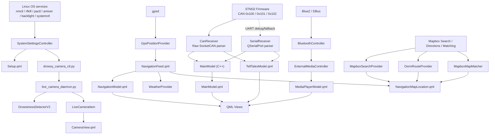
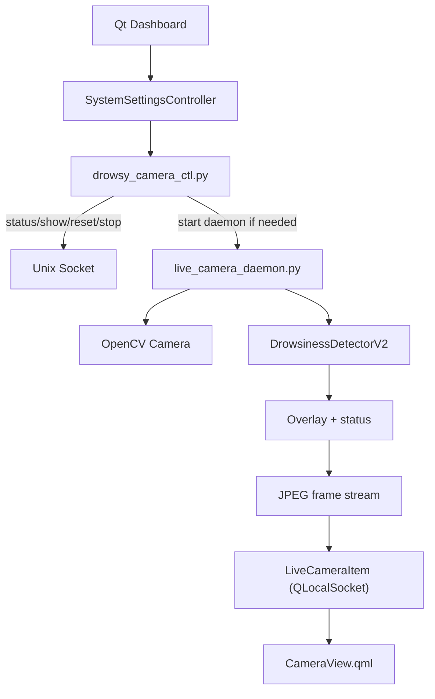

# Thiết kế phần mềm hệ thống IVI Automotive

## 1. Mục đích tài liệu

Tài liệu này mô tả chi tiết thiết kế phần mềm của hệ thống IVI Automotive dựa trên source code hiện tại trong repository. Phạm vi tài liệu tập trung vào:

- Kiến trúc phần mềm tổng thể
- Lớp giao diện người dùng QML
- Các service nền: Bluetooth, Navigation/Map, Weather, System Settings
- Khối AI giám sát tài xế DMS camera

Lưu ý: dữ liệu từ STM32 hiện được ưu tiên đưa vào dashboard bằng CAN 500 kbps qua SocketCAN `can0`; UART 115200 vẫn giữ làm debug/fallback.

---

## 2. Tổng quan kiến trúc phần mềm

### 2.1. Các tiến trình chính

Hệ thống phần mềm được chia thành 2 tiến trình chính:

1. `QtInstrumentCluster`
   - Viết bằng `C++ + QML`
   - Chạy dashboard IVI chính
   - Quản lý UI, navigation, bluetooth, media, weather, system settings
   - Nhận telemetry từ STM32 qua `CanReceiver`, fallback bằng `SerialReceiver`

2. `Driver-Drowsy-Detection`
   - Viết bằng `Python`
   - Chạy detector buồn ngủ trên camera
   - Được khởi chạy theo yêu cầu từ dashboard
   - Giao tiếp với Qt qua `Unix domain socket / local socket`

### 2.2. Phân lớp phần mềm

Về logic, kiến trúc phần mềm có thể chia thành 4 lớp:

| Lớp | Vai trò | Thành phần chính |
|---|---|---|
| **Integration Layer** | Kết nối phần cứng và dịch vụ hệ điều hành | `CanReceiver`, `SerialReceiver`, `GpsPositionProvider`, `BluetoothController`, `SystemSettingsController` |
| **Application Service Layer** | Xử lý nghiệp vụ navigation, media, weather, route, map search | `ExternalMediaController`, `OsrmRouteProvider`, `MapboxSearchProvider`, `MapboxMapMatcher`, `WeatherProvider` |
| **Presentation Model Layer** | Chuẩn hóa dữ liệu cho QML | `MainModelData`, `MainModel.qml`, `NavigationFeed.qml`, `NavigationModel.qml`, `MediaPlayerModel.qml`, `TellTalesModel.qml`, `NormalModeModel.qml` |
| **Presentation Layer** | Hiển thị dashboard và tương tác người dùng | `main.qml`, `NormalMode.qml`, `Navigation.qml`, `MediaPlayer.qml`, `Weather.qml`, `Setup.qml`, `CameraView.qml` |

### 2.3. Sơ đồ kiến trúc tổng thể

### 2.4. Bootstrap ứng dụng

Điểm vào của dashboard là `software/QtInstrumentCluster/main.cpp`. File này thực hiện các bước:

- Thiết lập môi trường Qt để phù hợp với Raspberry Pi và Mapbox GL
- Đăng ký các singleton/service C++ ra QML
- Khởi tạo `MainModel::initSerialReceiver()` để mở CAN receiver và UART fallback
- Khởi động `GpsPositionProvider`
- Nạp `main.qml`

Các singleton được publish ra QML gồm:

- `MainModelData`
- `TellTalesModel`
- `MainModel`
- `NormalModeModel`
- `MediaPlayerModel`
- `BluetoothManager`
- `NavigationFeed`
- `VehicleGps`
- `OsrmRoute`
- `MapboxSearch`
- `MapboxMapMatcher`
- `ExternalMedia`
- `SystemSettings`
- `Weather`

### 2.5. Luồng dữ liệu chính

#### Luồng 1: Telemetry từ STM32 lên dashboard

1. STM32 gửi frame CAN `0x100`, `0x101`, `0x102` qua CAN bus 500 kbps
2. `CanReceiver` đọc Raw SocketCAN từ `can0` và parse dữ liệu
3. `main.qml` dùng `Connections { target: canReceiver }` để đưa dữ liệu vào `MainModel` và `TellTalesModel`
4. Các QML view tự động redraw thông qua property binding
5. Nếu CAN không mở được, `SerialReceiver` vẫn có thể nhận UART text frame làm fallback/debug

#### Luồng 2: GPS đến navigation và weather

1. `GpsPositionProvider` lấy vị trí từ `gpsd`
2. `NavigationFeed.qml` làm lớp bridge giữa C++ GPS và QML
3. `NavigationMapLocation.qml` dùng vị trí này để bám xe trên bản đồ và yêu cầu route
4. `WeatherProvider` lấy vị trí xe để gọi Open-Meteo

#### Luồng 3: Bluetooth và media

1. `BluetoothController` quản lý scan/pair/connect qua BlueZ DBus
2. `ExternalMediaController` theo dõi session media của thiết bị Bluetooth
3. `MediaPlayerModel.qml` ánh xạ trạng thái media sang UI
4. `MediaPlayer.qml` hiển thị bài hát và điều khiển play/pause/next/previous

#### Luồng 4: DMS camera

1. `SystemSettingsController::launchDrowsyCamera()` gọi script control
2. Script đảm bảo daemon đang chạy hoặc tự khởi động nếu cần
3. Daemon mở camera, chạy AI detector, stream JPEG frame qua local socket
4. `LiveCameraItem` nhận và render frame vào `CameraView.qml`

---

## 3. Thiết kế phần UI (QML)

### 3.1. Cấu trúc giao diện tổng thể

`main.qml` là root window của dashboard, với thiết kế kích thước chuẩn `1024x600`.

Giao diện chính có các vùng:

- **Top bar**
  - Logo, thời gian, ngày tháng
  - Nút camera để mở DMS view
- **Left panel**
  - Hai gauge lớn: speed và RPM
  - Tell-tales indicator
  - ODO, range, fuel, battery, gear selector
  - Hình xe và lane assist
- **Right panel**
  - Nội dung động theo menu: Media, Navigation, Weather, Setup
- **Bottom menu**
  - Menu chuyển trang

`NormalMode.qml` chịu trách nhiệm layout hóa toàn bộ dashboard.

### 3.2. Tầng model trong QML

QML không truy cập trực tiếp vào mọi class C++; thay vào đó hệ thống dùng một lớp model trung gian để giữ UI đơn giản và reactive.

#### `MainModel.qml`

Chứa trạng thái chính của xe:

- `speed`
- `rpm`
- `odo`
- `range`
- `fuelLevel`
- `batteryLevel`
- `gearShiftText`

Đồng thời file này:

- Đồng bộ dữ liệu với `MainModelData` từ C++
- Tính ODO/range trong chế độ mô phỏng
- Tự suy luận gear khi không có hardware

#### `TellTalesModel.qml`

Quản lý trạng thái icon cảnh báo:

- Xi nhan trái/phải
- Beam
- High beams
- Parked
- Airbag

#### `NormalModeModel.qml`

Quản lý menu hiện tại và quick-control state:

- `MediaPlayerMenu`
- `NavigationMenu`
- `WeatherMenu`
- `CarStatusMenu` (đang dùng như Setup)

#### `NavigationFeed.qml`

Là adapter QML cho GPS runtime:

- Nhận `positionChanged` từ `VehicleGps`
- Publish vị trí hiện tại cho navigation và weather

#### `NavigationModel.qml`

Chứa trạng thái turn-by-turn:

- Step hiện tại
- Street hiện tại / kế tiếp
- Maneuver
- ETA
- Total distance
- Route progress

#### `MediaPlayerModel.qml`

Wrapper mỏng cho `ExternalMediaController`:

- `mediaPlayback`
- `currentSong`
- `currentArtist`
- Hàm play/stop/next/previous

### 3.3. Các màn hình giao diện chính

#### 3.3.1. Gauge và trạng thái xe

Các thành phần chính:

- `Gauge.qml`
- `BaseGauge.qml`
- `StatusBar.qml`
- `LinearGauge.qml`
- `TellTales.qml`
- `TellTalesIndicator.qml`
- `Car.qml`
- `LaneAssist.qml`

Vai trò:

- Hiển thị tốc độ và RPM dạng đồng hồ bán nguyệt
- Hiển thị gear selector `R/P/N/D`
- Hiển thị fuel, battery, ODO, range
- Hiển thị biểu tượng tell-tales theo tín hiệu phần cứng

#### 3.3.2. Media page

`MediaPlayer.qml` là màn hình media theo phong cách card:

- Hiển thị tên bài hát, nghệ sĩ, trạng thái phát
- Điều khiển playback
- Hỗ trợ media ngoài từ Bluetooth phone
- Hỗ trợ fallback phát nhạc local trên host

#### 3.3.3. Navigation page

`Navigation.qml` chỉ là vỏ bọc. Logic bản đồ tập trung trong `NavigationMapLocation.qml`.

Các chức năng chính:

- Hiển thị bản đồ qua `QtLocation`
- Dùng Mapbox style `navigation-guidance-night-v2`
- Theo dõi vị trí xe realtime
- Hỗ trợ tìm kiếm điểm đến
- Hỗ trợ nhập Telex tiếng Việt cho search box
- Yêu cầu route và vẽ polyline
- Tự reroute khi xe lệch tuyến
- Hỗ trợ map matching khi bật service tương ứng

Nếu map load lỗi hoặc thiếu token/plugin, hệ thống hiển thị fallback message thay vì crash UI.

#### 3.3.4. Weather page

`Weather.qml`:

- Lấy trạng thái thời tiết hiện tại theo vị trí xe
- Hiển thị nhiệt độ, condition, icon và location
- Tự refresh khi xe di chuyển đủ xa hoặc theo chu kỳ

#### 3.3.5. Setup page

`Setup.qml` cung cấp giao diện cấu hình tại chỗ:

- Bật/tắt Wi-Fi
- Bật/tắt Bluetooth
- Chỉnh âm lượng
- Chỉnh độ sáng
- Quét và kết nối Wi-Fi
- Mở popup Bluetooth device list
- Reboot và shutdown hệ thống

#### 3.3.6. Camera overlay

`CameraView.qml` là lớp phủ fullscreen dành cho DMS:

- Chứa `LiveCameraItem`
- Hiển thị trạng thái warm-up / connecting
- Chạm vào màn hình để đóng

### 3.4. Cơ chế binding giữa C++ và QML

Dashboard dùng 2 kỹ thuật binding chính:

1. **Singleton registration**
   - Dùng cho các service nền như `Weather`, `BluetoothManager`, `SystemSettings`, `VehicleGps`

2. **Signal bridge qua `Connections`**
   - Dùng trong `main.qml` để bắt tín hiệu từ `serialReceiver`
   - Mapping trực tiếp phần cứng sang QML model

Ví dụ mapping:

- `speedReceived` -> `MainModel.speed`
- `fuelLevelReceived` -> `MainModel.fuelLevel`
- `turnLeftChanged` -> `TellTalesModel.turnLeftActive`
- `mediaPlayToggled` -> `MediaPlayerModel.play()` hoặc `stop()`

### 3.5. Đặc điểm thiết kế UI

Các quyết định thiết kế nổi bật:

- UI tách rõ state và view
- Phần lớn component QML là declarative, dễ mở rộng
- Dùng singleton để tránh truyền state sâu qua nhiều tầng
- Hỗ trợ chạy cả khi không có hardware thật
- Tối ưu cho màn hình dashboard ngang 1024x600

---

## 4. Thiết kế phần Service

## 4.1. Service nhận dữ liệu phần cứng: `CanReceiver` và `SerialReceiver`

Mặc dù không nằm trong danh sách service người dùng yêu cầu, đây là service cốt lõi để dashboard hoạt động.

Chức năng chính:

- `CanReceiver` dùng Linux Raw SocketCAN để đọc `can0` mặc định, có thể đổi bằng `IVI_CAN_IFACE`.
- Parse 3 loại CAN frame: `0x100` telemetry, `0x101` button snapshot, `0x102` button event.
- `SerialReceiver` dùng `QSerialPort` cho UART debug/fallback khi CAN chưa sẵn sàng.
- Cả hai receiver phát cùng nhóm signal typed sang lớp trên để QML không phải biết chi tiết transport.

Thiết kế này giúp firmware STM32 và Qt app loosely coupled theo semantic signals, trong đó CAN là transport chính.

## 4.2. Bluetooth service

### 4.2.1. `BluetoothController`

Đây là service quản lý thiết bị Bluetooth trên Linux/Pi.

Chức năng:

- Kiểm tra adapter Bluetooth có sẵn hay không
- Bật/tắt power
- Scan thiết bị
- Bật chế độ pair mode
- Pair/connect/disconnect/forget device
- Tự reconnect thiết bị đã kết nối gần nhất

Kỹ thuật triển khai:

- Chạy trên Linux qua `BlueZ DBus`
- Tự subscribe signal từ BlueZ
- Có `BluezPairAgent` để xử lý flow pairing
- Persist `last_connected_address` bằng `QSettings`

Model thiết bị gồm:

- `name`
- `address`
- `paired`
- `trusted`
- `connected`
- `audioCapable`
- `rssi`
- `busy`
- `isLastConnected`

### 4.2.2. `Bluetooth.qml`

Là UI cho Bluetooth service:

- Nút ON/OFF
- Pair mode
- Scan
- Danh sách thiết bị audio-capable
- Nút Pair/Connect/Disconnect/Forget

## 4.3. Media service

### `ExternalMediaController`

Service này kết nối media UI với nguồn media thực tế.

Có 2 chế độ:

1. **External session mode**
   - Đọc session media từ điện thoại Bluetooth
   - Theo dõi player qua DBus/BlueZ trên Linux

2. **Host fallback mode**
   - Quét thư mục local music
   - Dùng `QMediaPlayer` phát nội bộ

Chức năng:

- Play
- Pause
- Toggle playback
- Next
- Previous
- Đọc metadata bài hát / nghệ sĩ

Vai trò của service này là biến trang Media thành một dashboard điều khiển media thực thụ, thay vì chỉ là mock UI.

## 4.4. Navigation và Map service

Phần map/navigation của hệ thống không nằm trong một class duy nhất mà là một cụm service phối hợp với nhau.

### 4.4.1. `GpsPositionProvider`

Nguồn dữ liệu vị trí thực tế.

Chức năng:

- Kết nối `gpsd` qua TCP
- Gửi watch command để nhận stream dữ liệu
- Parse object JSON từ gpsd
- Cung cấp:
  - `latitude`
  - `longitude`
  - `speedKmh`
  - `headingDeg`
  - `horizontalAccuracyMeters`
  - `timestampMs`

Ngoài việc chỉ đọc vị trí, class này còn có:

- Reconnect timer
- Smoothing vị trí
- Outlier filtering
- Freeze heading khi xe gần đứng yên

Điều này rất quan trọng để icon xe trên bản đồ không bị rung.

### 4.4.2. `NavigationFeed.qml`

Bridge QML cho GPS:

- Nhận signal từ `VehicleGps`
- Publish thành `positionUpdated`
- Cho phép mọi màn hình QML cùng dùng dữ liệu vị trí theo một format thống nhất

### 4.4.3. `OsrmRouteProvider`

Tên class là `OsrmRouteProvider`, nhưng ở runtime hiện tại nó đang được cấu hình thành `provider = mapbox` trong `main.cpp`.

Chức năng:

- Gửi request route giữa 2 tọa độ
- Parse GeoJSON geometry
- Parse step instruction
- Xuất:
  - `routePath`
  - `routeSteps`
  - `alternativeRoutes`
  - `distanceMeters`
  - `durationSeconds`

Kết quả được dùng trực tiếp trong QML để:

- Vẽ polyline
- Hiển thị turn-by-turn
- Tính ETA

### 4.4.4. `MapboxSearchProvider`

Service tìm kiếm điểm đến.

Chức năng:

- Gọi Mapbox Search Box API `/suggest`
- Gọi `/retrieve` để lấy thông tin chi tiết
- Quản lý session token cho một phiên tìm kiếm
- Hỗ trợ bias kết quả theo vị trí xe hiện tại
- Cho phép cấu hình language/country/types qua biến môi trường

Kết quả trả về là danh sách suggestion dùng trực tiếp trong QML search panel.

### 4.4.5. `MapboxMapMatcher`

Service map-matching tùy chọn.

Chức năng:

- Thu thập trace point từ GPS
- Gửi trace đến Mapbox Matching API
- Trả về `matchedLatitude`, `matchedLongitude`, `confidence`

Vai trò:

- Giúp icon xe bám sát đường hơn
- Giảm sai lệch do GPS noise
- Tăng cảm giác mượt khi theo dõi vị trí trên navigation map

### 4.4.6. `NavigationModel.qml`

Model nghiệp vụ cho navigation:

- Quản lý route step hiện tại
- Tính distance to turn
- Tính progress của route
- Tính ETA
- Cập nhật step theo vị trí xe chạy

### 4.4.7. `NavigationMapLocation.qml`

Đây là trung tâm phối hợp của navigation UI.

Nhiệm vụ:

- Hiển thị map
- Theo xe
- Xử lý zoom/tilt/overview
- Điều khiển search box
- Gọi route provider
- Cập nhật path segments
- Trigger reroute
- Chọn destination từ search result

Một điểm đáng chú ý là file này còn hỗ trợ normalize Telex tiếng Việt cho ô tìm kiếm, giúp trải nghiệm tìm địa điểm trên dashboard thực tế hơn.

## 4.5. Weather service

### `WeatherProvider`

Service thời tiết sử dụng `Open-Meteo`.

Chức năng:

- Nhận vị trí xe từ GPS
- Gọi API current weather
- Parse:
  - nhiệt độ
  - điều kiện thời tiết
  - icon type
  - last updated

Chiến lược refresh:

- Tự refresh định kỳ `10 phút`
- Refresh sớm nếu xe di chuyển đủ xa
- Chờ GPS fix trước khi request

Chi tiết implementation nổi bật:

- Dùng `QNetworkAccessManager` mặc định
- Nếu Qt SSL backend có vấn đề, tự fallback sang `curl`
- Điều này đặc biệt hữu ích trên Raspberry Pi khi môi trường SSL thiếu ổn định

## 4.6. System settings service

### `SystemSettingsController`

Đây là service cầu nối giữa UI Setup và Linux system backend.

Chức năng chính:

- Wi-Fi:
  - Scan mạng
  - Kết nối
  - Ngắt kết nối
  - Bật/tắt radio
- Bluetooth:
  - Đồng bộ trạng thái power
  - Bật/tắt radio
- Volume:
  - Ghi mức âm lượng hệ thống
- Brightness:
  - Ghi độ sáng backlight
- Power:
  - Reboot
  - Shutdown
  - Restart app
- AI:
  - Khởi chạy DMS camera

Backend Linux đang được dùng:

| Chức năng | Backend |
|---|---|
| Wi-Fi management | `nmcli` hoặc `rfkill` |
| Bluetooth power | `bluetoothctl` hoặc `rfkill` |
| Volume | `pactl` hoặc `amixer` |
| Brightness | `/sys/class/backlight/*` |
| Power control | `systemctl` |
| DMS launch | `QProcess::startDetached()` |

Thiết kế đáng chú ý:

- Volume và brightness được throttle để tránh spam command khi kéo slider
- Brightness được snap theo mức rời rạc để đảm bảo cảm giác ổn định
- Có `syncFromSystem()` để đồng bộ lại state từ hệ điều hành

---

## 5. Thiết kế phần AI (DMS camera)

## 5.1. Mục tiêu của khối AI

Khối DMS camera dùng để:

- Theo dõi trạng thái tỉnh táo của tài xế
- Phát hiện trạng thái `awake`, `warning`, `drowsy`
- Cung cấp camera view trực tiếp trong dashboard
- Tách riêng xử lý AI khỏi tiến trình UI để không làm lag dashboard

## 5.2. Kiến trúc runtime của DMS

### 5.2.1. `drowsy_camera_ctl.py`

Là control utility của DMS. Hỗ trợ các lệnh:

- `show`
- `hide`
- `status`
- `reset`
- `stop`

Nếu daemon chưa chạy, script có thể tự khởi động daemon trước rồi mới gửi command.

### 5.2.2. `live_camera_daemon.py`

Là headless background daemon.

Trách nhiệm:

- Mở camera bằng OpenCV
- Khởi tạo detector
- Chạy loop suy luận realtime
- Vẽ overlay thông tin AI lên frame
- Nhận command từ local socket
- Stream frame tới client

Daemon không phụ thuộc vào giao diện Qt, nhờ vậy:

- Có thể giữ model luôn warm
- Không phải reload model mỗi lần mở camera
- UI vẫn mượt dù AI đang chạy

### 5.2.3. IPC giữa Qt và DMS

Giao tiếp giữa Qt và daemon dùng `Unix domain socket`.

Chi tiết:

- Control plane: JSON line protocol
- Data plane: frame stream với header `FRAM + payload_size + jpeg_data`

Qt side:

- `LiveCameraItem` dùng `QLocalSocket`
- Tự reconnect nếu daemon đang khởi động lại
- Decode JPEG rồi render lên `QQuickPaintedItem`

## 5.3. Pipeline suy luận AI

### 5.3.1. Thành phần detector

Class lõi là `DrowsinessDetectorV2`.

Pipeline gồm 4 nhánh:

1. `Eye CNN`
   - Mô hình TFLite nhận crop vùng mắt
   - Trả về xác suất mắt mở/nhắm

2. `EAR / PERCLOS`
   - EAR tính từ FaceMesh landmarks
   - PERCLOS tính tỉ lệ frame mắt nhắm trong cửa sổ thời gian

3. `Yawn CNN + MAR`
   - MAR tính độ mở miệng
   - Yawn CNN nhận crop vùng miệng

4. `Head Pose`
   - Ước lượng bằng `solvePnP`
   - Theo dõi pitch, yaw, roll

### 5.3.2. Fusion và temporal smoothing

Điểm drowsiness cuối cùng là tổng có trọng số của:

- Eye CNN
- EAR/PERCLOS
- Yawn counter
- Head pose

Sau đó hệ thống áp dụng temporal smoothing:

- Tránh cảnh báo giả do nhiễu trong một vài frame
- Chỉ alert khi trạng thái buồn ngủ duy trì đủ lâu

### 5.3.3. Overlay runtime

`live_camera_common.py` chịu trách nhiệm:

- Vẽ bounding box face/eye/mouth
- In ra trạng thái `AWAKE / WARNING / DROWSY`
- Hiển thị:
  - FPS
  - Fusion score
  - EAR
  - MAR
  - Eye CNN score
  - Yawn CNN score
  - Head pose

Khi phát hiện buồn ngủ, overlay hiển thị cảnh báo đỏ nổi bật.

## 5.4. Tích hợp AI vào dashboard

AI hiện đang được tích hợp theo hướng:

- Dashboard không trực tiếp chạy TensorFlow/TFLite loop
- Dashboard chỉ làm client gọi control script và nhận stream
- Điều này giữ cho `QtInstrumentCluster` đơn giản hơn, ổn định hơn, dễ maintain hơn

Các điểm tích hợp chính:

- `SystemSettingsController::launchDrowsyCamera()`
- `main.qml` có icon camera ở top bar
- `CameraView.qml` hiển thị live stream từ daemon

---

## 6. Đánh giá thiết kế hiện tại

## 6.1. Điểm mạnh

- Tách biệt rõ UI, service và AI runtime
- Có thể phát triển dashboard và AI độc lập
- Luồng dữ liệu phần cứng đơn giản, dễ debug
- QML tận dụng tốt binding và singleton
- Service layer bám sát Linux/Raspberry Pi thực tế
- AI được tách thành process riêng nên không khóa UI

## 6.2. Điểm cần lưu ý

- Navigation phụ thuộc Mapbox token và plugin QtLocation phù hợp
- Một số service gắn với Linux backend nên tính portable sang Windows thấp
- `OsrmRouteProvider` hiện là lớp abstraction nhưng runtime đang bias mạnh về Mapbox
- DMS camera hiện chủ yếu hiển thị overlay; nếu cần cảnh báo đa kênh hơn có thể bổ sung event callback ngược về dashboard hoặc firmware

## 6.3. Hướng mở rộng

- Thêm event bus chung giữa dashboard và DMS để tạo cảnh báo ngữ cảnh
- Đưa AI alert vào cụm tell-tales hoặc popup dashboard
- Chuẩn hóa service interface để giảm phụ thuộc backend hệ điều hành
- Tách navigation service thành module riêng để dễ test hơn

---

## 7. Kết luận

Thiết kế phần mềm hiện tại của hệ thống IVI Automotive đã hình thành một kiến trúc tương đối hoàn chỉnh cho demo sản phẩm:

- `STM32` phụ trách thu thập tín hiệu vật lý
- `QtInstrumentCluster` phụ trách HMI và các service người dùng
- `Driver-Drowsy-Detection` phụ trách AI giám sát tài xế

Điểm mạnh lớn nhất của hệ thống là sự tách lớp rõ ràng: dữ liệu phần cứng, service hệ thống, presentation model, UI và AI camera được tổ chức thành các khối độc lập nhưng vẫn phối hợp theo luồng dữ liệu realtime. Đây là nền tảng tốt để tiếp tục mở rộng từ demo học thuật sang nguyên mẫu sản phẩm thực tế.
